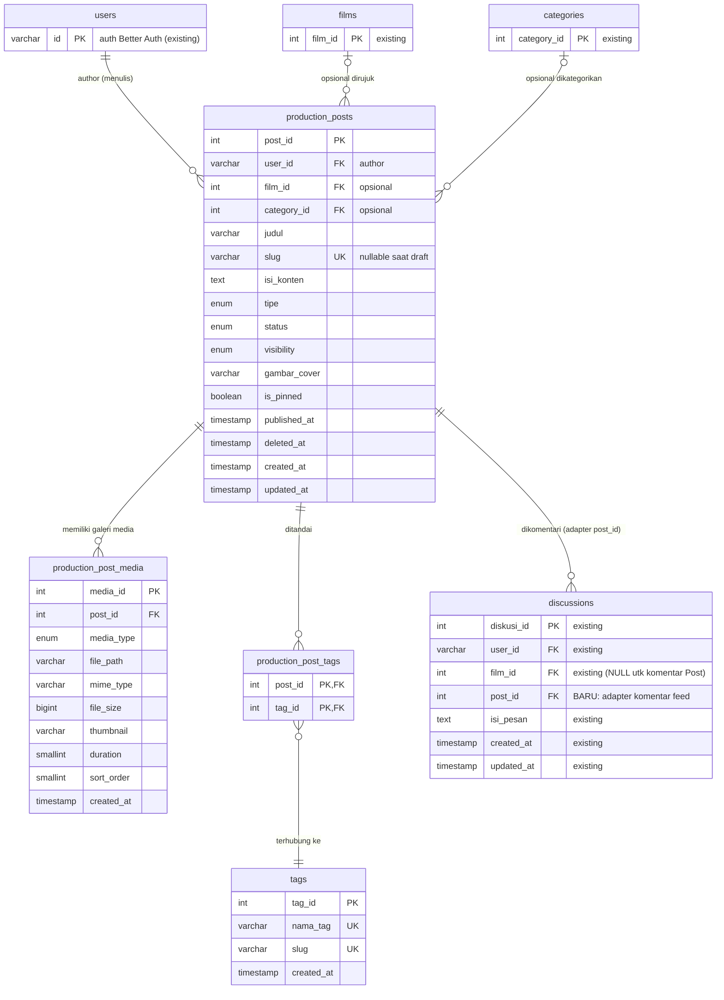

# 🗄️ Rancangan Database — Production Feed

> Dokumen ini adalah **rancangan database** untuk bounded context **Production Feed**.
>
> - **TIDAK membuat migration** — murni desain (sesuai GLOBAL RULES).
> - Mengikuti **Database Standard** project: MySQL (InnoDB), `snake_case`, PK auto-increment, timestamp `created_at`/`updated_at`, `onDelete` eksplisit, penamaan index `idx_<table>_<kolom>`.
> - Mengikuti pola tabel existing: `films`, `carousel_items`, `learning_materials`, `community_discussions`/`community_replies`, `categories`.
> - Perluasan dari `docs/feed/ARCHITECTURE_PRODUCTION_FEED.md` dengan satu revisi desain (media: dari JSON → tabel normalisasi, lihat §6.1).

---

## 1. Ringkasan & Keputusan Kunci

| Keputusan | Pilihan | Alasan singkat |
|---|---|---|
| Status siklus hidup | `draft` / `published` / `archived` | Memenuhi Draft–Publish–Archive; meniru pola enum `status` di `films`. |
| Soft delete | Kolom `deleted_at TIMESTAMP NULL` | Audit trail, restorasi, recycle bin (future), tanpa merusak FK komentar/media. |
| Media Photo/Video/PDF | Tabel terpisah `production_post_media` | Normalisasi; metadata per tipe (mime, size, duration, thumbnail, urutan) → future-friendly. |
| Cover | Kolom `gambar_cover` di `production_posts` | Satu gambar utama untuk listing feed (pola `films.gambar_poster`); file tidak diduplikasi (path sama dengan media). |
| Category | **Reuse** tabel `categories` yang sudah ada | `category_id` FK nullable (pola `films.category_id`); tidak membuat tabel duplikat. |
| Tag | Tabel baru `tags` + junction `production_post_tags` | Belum ada tabel tag di project; dibuat **khusus context feed**, tidak menyentuh module lain. |
| Film (optional) | `film_id` FK nullable `ON DELETE SET NULL` | Relasi opsional; pola `carousel_items.film_id`. Feed tidak menulis ke `films`. |
| Slug | `slug VARCHAR(255)` nullable UNIQUE, dibuat saat publish | Pola `generateSlug(judul, id)` di films; nullable saat draft → bebas konflik & natural unique. |
| Visibility | `public` / `private` (default `public`) | Kontrol audiens tanpa mengubah struktur modul lain. |
| Future friendly | `published_at`, `is_pinned`, metadata media, kolom `embedding` opsional | Siap untuk jadwal publish, kurasi editor, analytics, transcode video, search semantik. |

---

## 2. ERD

---

## 3. Detail Tabel

### 3.1 `production_posts` — entitas utama Post

| Kolom | Tipe | Constraint | Keterangan |
|---|---|---|---|
| `post_id` | INT UNSIGNED | PK, AI | Primary key |
| `user_id` | VARCHAR(36) | NOT NULL, FK → `users.id` | **Author** (pola `films.user_id`) |
| `film_id` | INT UNSIGNED | NULL, FK → `films.film_id` | **Film opsional** (pola `carousel_items.film_id`) |
| `category_id` | INT UNSIGNED | NULL, FK → `categories.category_id` | **Category** (reuse tabel existing, pola `films.category_id`) |
| `judul` | VARCHAR(255) | NOT NULL | Judul post |
| `slug` | VARCHAR(255) | UNIQUE, NULL | Slug URL; diisi saat publish |
| `isi_konten` | TEXT | NOT NULL | Isi konten (disanitasi) |
| `tipe` | ENUM(`progress`,`behind_the_scenes`,`casting`,`announcement`,`wrap`) | NOT NULL, DEFAULT `progress` | Jenis konten feed |
| `status` | ENUM(`draft`,`published`,`archived`) | NOT NULL, DEFAULT `draft` | **Draft / Publish / Archive** |
| `visibility` | ENUM(`public`,`private`) | NOT NULL, DEFAULT `public` | **Visibility** audiens |
| `gambar_cover` | VARCHAR(500) | NULL | **Cover** utama untuk listing |
| `is_pinned` | BOOLEAN | NOT NULL, DEFAULT `false` | Kurasi editor (future-friendly) |
| `published_at` | TIMESTAMP | NULL | Waktu publish (ordering feed, jadwal publish future) |
| `deleted_at` | TIMESTAMP | NULL | **Soft Delete** (`NULL` = aktif) |
| `created_at` | TIMESTAMP | NOT NULL, DEFAULT `NOW()` | Otomatis (`BaseModel`) |
| `updated_at` | TIMESTAMP | NOT NULL, DEFAULT `NOW()` | Otomatis (`BaseModel`) |

### 3.2 `production_post_media` — galeri Photo / Video / PDF

| Kolom | Tipe | Constraint | Keterangan |
|---|---|---|---|
| `media_id` | INT UNSIGNED | PK, AI | Primary key |
| `post_id` | INT UNSIGNED | NOT NULL, FK → `production_posts.post_id` | Parent post (CASCADE) |
| `media_type` | ENUM(`photo`,`video`,`pdf`) | NOT NULL | **Photo / Video / PDF** |
| `file_path` | VARCHAR(500) | NOT NULL | Path `/uploads/...` (dari Tus) |
| `mime_type` | VARCHAR(100) | NULL | Untuk serving yang tepat (future: range/stream) |
| `file_size` | BIGINT UNSIGNED | NULL | Ukuran byte (future: quota/analytics) |
| `thumbnail` | VARCHAR(500) | NULL | Poster video / preview PDF |
| `duration` | SMALLINT UNSIGNED | NULL | Durasi video (detik) |
| `sort_order` | SMALLINT UNSIGNED | NOT NULL, DEFAULT `0` | Urutan tampilan dalam galeri |
| `created_at` | TIMESTAMP | NOT NULL, DEFAULT `NOW()` | Otomatis |

### 3.3 `tags` + `production_post_tags` — Tag (M:N)

**`tags`** (baru, khusus context feed):

| Kolom | Tipe | Constraint | Keterangan |
|---|---|---|---|
| `tag_id` | INT UNSIGNED | PK, AI | Primary key |
| `nama_tag` | VARCHAR(100) | NOT NULL, **UNIQUE** | Nama tag |
| `slug` | VARCHAR(120) | NOT NULL, **UNIQUE** | Slug untuk halaman/filter tag |
| `created_at` | TIMESTAMP | NOT NULL, DEFAULT `NOW()` | Otomatis |

**`production_post_tags`** (junction, pola junction M:N standar):

| Kolom | Tipe | Constraint | Keterangan |
|---|---|---|---|
| `post_id` | INT UNSIGNED | PK (komposit), FK → `production_posts.post_id` | CASCADE |
| `tag_id` | INT UNSIGNED | PK (komposit), FK → `tags.tag_id` | CASCADE |

### 3.4 Komentar Post — adapter di atas `discussions` existing

Komentar Post **tidak memakai tabel baru**. Migration `20260807000000_add_post_id_to_discussions.js` menambahkan **satu kolom nullable** pada tabel `discussions` yang sudah ada:

| Kolom (baru) | Tipe | Constraint | Keterangan |
|---|---|---|---|
| `post_id` | INT UNSIGNED | NULL, FK → `production_posts.post_id` | **Adapter**: komentar feed; `NULL` = komentar film biasa |
| `film_id` | INT UNSIGNED | NULL (diubah dari NOT NULL) | Diberi nullable karena komentar feed tidak merujuk film |

Aturan:
- Kolom `post_id` dan `film_id` **saling eksklusif**; komentar film existing (`film_id` terisi) tidak terpengaruh.
- Aturan domain feed (post harus `published` & `public`, notifikasi penulis post) dijaga di `productionFeed.commentAdapter.js`, bukan di schema.
- **Reuse penuh**: kolom `user_id`, `isi_pesan`, `created_at`, `updated_at`, recursive CTE delete, `user` relation — semuanya struktur `discussions` yang sudah ada.

---

## 4. Relasi

| Dari | Ke | Kardinalitas | Deskripsi |
|---|---|---|---|
| `users` | `production_posts` | 1 — N | Author menulis banyak post |
| `production_posts` | `films` | N — 0..1 | Post **opsional** merujuk satu film |
| `categories` | `production_posts` | 1 — 0..N | Post **opsional** masuk satu kategori (reuse) |
| `production_posts` | `production_post_media` | 1 — N | Satu post punya banyak media |
| `production_posts` | `production_post_tags` | 1 — N | Junction |
| `tags` | `production_post_tags` | 1 — N | Junction |
| `production_posts` | `discussions` | 1 — N | Satu post punya banyak komentar (via `post_id`, adapter) |

> **Keterbacaan relasi:** satu-satunya relasi timbal balik adalah FK adapter `discussions.post_id → production_posts` (satu kolom nullable untuk komentar). Tidak ada modifikasi perilaku tabel existing lain → **low coupling** tetap terjaga.

---

## 5. Foreign Key & Aksi Referensi

| FK | Kolom | References | On Delete | Alasan |
|---|---|---|---|---|
| `fk_production_posts_user` | `user_id` | `users.id` | `CASCADE` | Penulis; saat user dihapus, post ikut hapus (pola `films.user_id`, `community_discussions.user_id`) |
| `fk_production_posts_film` | `film_id` | `films.film_id` | `SET NULL` | **Opsional**; film terhapus → post tetap ada (pola `carousel_items.film_id`) |
| `fk_production_posts_category` | `category_id` | `categories.category_id` | `SET NULL` | **Opsional**; kategori terhapus → post tetap ada (pola `films.category_id`) |
| `fk_pp_media_post` | `post_id` | `production_posts.post_id` | `CASCADE` | Media galeri tidak pernah hidup tanpa post |
| `fk_pp_tags_post` | `post_id` | `production_posts.post_id` | `CASCADE` | Junction mengikuti post |
| `fk_pp_tags_tag` | `tag_id` | `tags.tag_id` | `CASCADE` | Junction mengikuti tag |
| `discussions_post_id_foreign` (auto) | `post_id` | `production_posts.post_id` | `CASCADE` | Komentar Post (adapter) tidak pernah hidup tanpa post |

> Catatan: `ON DELETE CASCADE` pada media & komentar hanya berlaku saat post di-**hard delete** (soft delete tidak menghapus baris, hanya `deleted_at`).

---

## 6. Index

| Tabel | Nama Index | Kolom | Tipe | Kebutuhan yang dilayani |
|---|---|---|---|---|
| `production_posts` | `idx_production_posts_slug` | `slug` | **UNIQUE** | Lookup detail by slug; mencegah duplikat |
| `production_posts` | `idx_production_posts_feed` | `(status, visibility, published_at)` | Normal | **Query utama feed**: `WHERE status='published' AND visibility='public' AND deleted_at IS NULL ORDER BY published_at DESC` |
| `production_posts` | `idx_production_posts_user_published` | `(user_id, published_at)` | Normal | Feed "post saya" / feed per author |
| `production_posts` | `idx_production_posts_film` | `(film_id)` | Normal | Filter post per film |
| `production_posts` | `idx_production_posts_category` | `(category_id)` | Normal | Filter per kategori |
| `production_posts` | `idx_production_posts_pin` | `(is_pinned)` | Normal | Post pinned di atas feed |
| `production_post_media` | `idx_pp_media_post_order` | `(post_id, sort_order)` | Normal | Mengambil galeri terurut per post (prefix `post_id` juga melayani FK) |
| `tags` | `idx_tags_name` | `nama_tag` | **UNIQUE** | Pencarian/deduplikasi tag |
| `tags` | `idx_tags_slug` | `slug` | **UNIQUE** | Lookup tag page |
| `production_post_tags` | `idx_pp_tags_tag` | `(tag_id)` | Normal | Reverse lookup tag → posts (selain PK komposit `(post_id, tag_id)`) |
| `discussions` | `idx_discussions_post` | `(post_id)` | Normal | Ambil komentar per Post (adapter) |

> Konvensi nama `idx_<table>_<kolom>` mengikuti `add_performance_indexes.js`. Untuk `media`/`tags` prefix index dipersingkat (`idx_pp_*`) agar tidak melewati batas panjang nama index MySQL (64 char).

---

## 7. Alasan Desain

### 7.1 Draft–Publish–Archive (status)
- Satu kolom enum `status` menggantikan `is_active` boolean (pola `learning_materials.is_active`) agar alur **draft → published → archived** eksplisit dan bisa diekstensi (misal `scheduled`) tanpa alter.
- `published_at` dipisah dari `created_at`: published saat ini, maka ordering feed berdasar waktu publish, bukan waktu buat — penting karena post bisa lama di draft.

### 7.2 Photo / Video / PDF + Cover (media)
- Media dipisah ke `production_post_media` (bukan JSON seperti `films.crew`) karena media punya **metadata per tipe** (`mime_type`, `file_size`, `thumbnail`, `duration`, `sort_order`) dan butuh query/ordering. JSON sulit di-index & query per file.
- `gambar_cover` di tabel post (bukan di media) agar listing feed hanya 1 query tanpa join/jumlah media, mengikuti preseden `films.gambar_poster`. Jika cover adalah salah satu foto galeri, app cukup **menyalin path** (tanpa duplikasi file).
- Semua path mengikuti Upload Guide: `/uploads/{subfolder}/{file}` dari endpoint Tus; pembersihan fisik via `deleteFile()` `lib/upload.js`.

### 7.3 Category — reuse, bukan duplikasi
- Tabel `categories` **sudah ada** dan `films.category_id` menjadi preseden. Feed memakai FK `category_id` yang sama (nullable, `SET NULL`).
- **Tanpa perubahan schema** ke `categories`; hanya penambahan baris kategori — memenuhi prinsip *reusability* dan *jangan ubah module lain kecuali diperlukan*.

### 7.4 Tag
- Tidak ada tabel tag existing → dibuat `tags` + junction `production_post_tags` yang **terisolasi dalam context feed**. M:N agar satu post bisa punya banyak tag dan satu tag dipakai banyak post; UNIQUE `nama_tag`/`slug` mencegah duplikat.

### 7.5 Optional Film
- `film_id` nullable + `ON DELETE SET NULL` (pola `carousel_items`): post tetap hidup bila film dihapus. **Read-only** — feed tidak menulis ke `films`, menjaga batas bounded context.

### 7.6 Slug
- `slug` nullable saat draft, diisi saat publish via `generateSlug(judul, post_id)` (pola `films`): kombinasi base + id menjamin **selalu unique**, bahkan setelah soft delete, tanpa perlu regenerate acak. UNIQUE index menegakkan integritas.

### 7.7 Visibility
- `public` (muncul di feed publik) vs `private` (hanya author + admin). Siap untuk future (misal `members_only`) via penambahan enum value tanpa perubahan struktur.

### 7.8 Author
- `user_id VARCHAR(36)` FK `users.id` CASCADE — tipe sama dengan seluruh tabel yang merefer `users` (Better Auth). Ownership & moderasi query berbasis kolom ini.

### 7.9 Soft Delete
- Kolom `deleted_at` (nullable) adalah **pola baru untuk project** (belum ada di tabel lain) dan **di-scope hanya ke context feed** — tidak menyentuh module lain.
- Alasan: (1) audit trail & moderasi dapat memulihkan post; (2) media (`production_post_media`) & komentar (`discussions.post_id`) tetap valid saat post diarsip/dihapus lunak; (3) future features: recycle bin, restore, statistik hapus.
- Semua query aktif wajib `WHERE deleted_at IS NULL`; hard-delete (baris+file fisik) hanya untuk admin bila diperlukan.

### 7.10 Future Feature Friendly
- `published_at` → scheduled publish & analytics.
- `is_pinned` → kurasi editorial (pinned di atas).
- Metadata media → transcode video, thumbnail, storage quota, range request.
- `visibility` → audience targeting.
- Tags/kategori normalisasi → tag pages, related posts, filter lanjutan.
- Kolom `embedding` (JSON) **dapat ditambahkan belakangan** via migration (pola `films.embedding`) untuk search semantik tanpa mengubah struktur lain.

---

## 8. Konvensi yang Diikuti & Deviasi

| Aspek | Konvensi project | Penerapan di feed |
|---|---|---|
| PK | `increments('id')` bernama `<entity>_id` | `post_id`, `media_id`, `tag_id` (komentar memakai `diskusi_id` existing) |
| Timestamp | `created_at`/`updated_at` default now (atau `timestamps(true,true)`) | Diikuti |
| Enum | `table.enum('tipe', [...])` (pola `learning_materials`) | `status`, `visibility`, `media_type` |
| FK inline | `.references().inTable().onDelete()` | Diikuti |
| Soft delete | *(belum ada di project)* | **Baru**, di-scope hanya ke feed (§7.9) |
| Media multi-file | `films.crew` JSON | **Deviasi**: tabel normalisasi `production_post_media` (§7.2) |
| Komentar | `discussions` existing (komentar film) | **Reuse via adapter**: kolom `post_id` nullable, tanpa tabel baru (§3.4) |

---

## 9. Checklist Self-Review

- [x] Tidak membuat migration (murni rancangan).
- [x] Mendukung Draft / Publish / Archive (`status` + `published_at`).
- [x] Mendukung Photo / Video / PDF / Cover (`production_post_media` + `gambar_cover`).
- [x] Mendukung Category (reuse `categories`), Tag (`tags` + junction).
- [x] Film opsional (`film_id` nullable, `SET NULL`, read-only).
- [x] Slug unique (nullable saat draft, pola `generateSlug`).
- [x] Visibility (`public`/`private`).
- [x] Author (`user_id` FK `users.id` CASCADE).
- [x] Soft Delete (`deleted_at`) — future friendly & scoped.
- [x] Komentar Post via adapter di `discussions.post_id` (nullable, tanpa tabel baru; komentar film existing tidak berubah).
- [x] ERD, Relasi, Index, Foreign Key, dan Alasan desain terdokumentasi.
- [x] Pola project diikuti (snake_case, enum, FK, index naming, InnoDB/utf8mb4).
- [x] Low coupling (tidak ada module lain yang merefer tabel feed).
