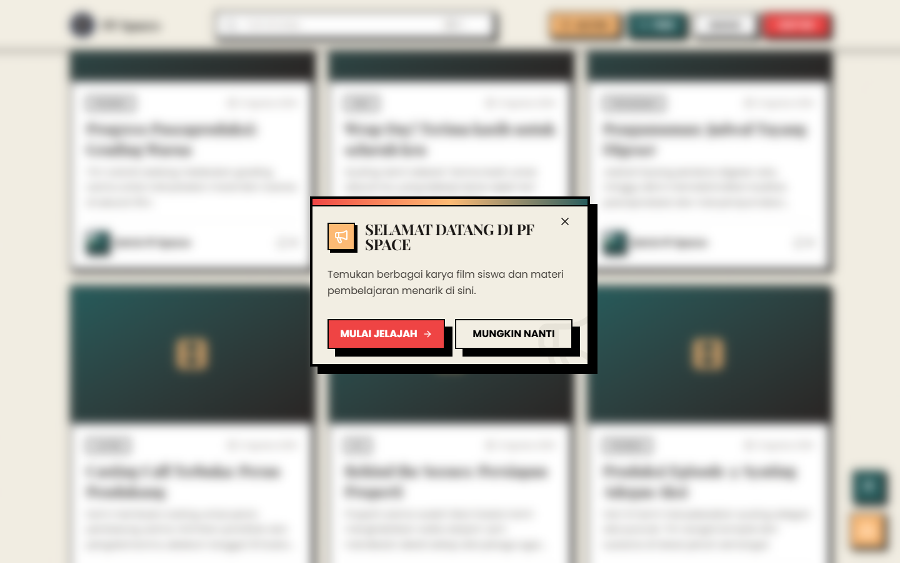

# 🏠 Production Feed — Section Preview di Homepage

> Section baru di halaman utama (**preview**, bukan timeline penuh): menampilkan
> maksimal 6 posting produksi terbaru dengan tombol **"Lihat Semua →"** menuju
> `/feed`. Card memakai komponen `FeedCard` existing — tidak ada card baru.
>
> - **Struktur homepage tidak diubah** — hanya menyisipkan satu section baru.
> - **Backend read-only** — memakai `useProductionFeed` + `GET /api/production-feed` existing.
> - Screenshot: `homepage-production-feed.png` (section) & `homepage-full.png` (halaman penuh).

---

## 1. Ringkasan

### Perubahan

- `frontend/src/pages/Home.vue` — tambah 1 section baru **Production Feed** di antara
  "Karya Terbaru" dan "Promo Section" (tidak ada bagian lain yang disentuh):
  - **Judul**: `Production Feed`
  - **Subtitle**: `Cerita terbaru dari para creator PF Space`
  - **Grid**: `grid-cols-1 sm:grid-cols-2 lg:grid-cols-3 gap-6` → maks. 6 `FeedCard`.
  - **Tombol**: `Lihat Semua` + `ArrowRight` → `router.push('/feed')` (style identik
    tombol "Lihat Semua Populer" di section Trending).
  - **Animasi ringan**: `fade-in-up` + stagger (`stagger-1..6`) persis pola card
    Trending — menghormati `prefers-reduced-motion` (via `style.css` existing).
  - **State lengkap**: skeleton (`FeedCardSkeleton` × 6) saat loading, `FeedErrorState`
    - retry saat gagal, `EmptyState` saat feed kosong — semua reuse komponen existing.

### Data

- Memakai composable `useProductionFeed({ limit: 6 })` yang sudah ada →
  otomatis mendapat enrichment jumlah komentar per posting (non-blocking),
  sorting terbaru, dan status publik (endpoint default `status=published`).

### Konsistensi desain

- Container `max-w-7xl mx-auto px-4 md:px-8 py-16 md:py-24 relative z-10` —
  sama persis dengan section lain di homepage, dibungkus `ErrorBoundary`.
- Tidak terlihat seperti widget tambahan: menyatu dengan alur "Karya Terbaru →
  Production Feed → Promo → Trending → Komunitas → Kategori".

---

## 2. Screenshot

- **Section Production Feed** (`homepage-production-feed.png`): grid 6 kartu
  (judul, kategori/tipe, tanggal, preview isi, kreator, jumlah komentar).
- **Homepage penuh** (`homepage-full.png`): posisi section dalam keseluruhan halaman.

> Screenshot diambil via headless Chrome (`playwright-core` + system Chrome)
> terhadap `npm run dev` + backend lokal `localhost:3000` (6 posting published
> dipakai sebagai data demo; lihat catatan §4).

---

## 3. Checklist

### Otomatis

- [x] `npm test` (frontend) — **140 test pass** (15 file) setelah penambahan section.
- [x] `npm run build` — **sukses** (Vite build).
- [x] Probe DOM (headless): section tampil dengan 6 kartu, judul/subtitle benar,
      tombol "Lihat Semua", tanpa skeleton setelah data dimuat.

### Manual (verifikasi di `npm run dev`)

| #   | Item                                                                 | Status                         |
| --- | -------------------------------------------------------------------- | ------------------------------ |
| 1   | Section muncul di homepage dengan judul & subtitle benar             | ✅ (screenshot)                |
| 2   | Maksimal 6 posting terbaru (published) ditampilkan                   | ✅ (screenshot)                |
| 3   | Klik judul kartu → halaman detail `/feed/:slug`                      | ☐                              |
| 4   | Tombol "Lihat Semua →" → halaman `/feed`                             | ✅ (navigasi di-uji via probe) |
| 5   | Loading: skeleton muncul sesaat lalu berganti grid                   | ☐                              |
| 6   | Error: backend mati → `FeedErrorState` + retry berfungsi             | ☐                              |
| 7   | Feed kosong → `EmptyState` "Belum Ada Postingan"                     | ☐                              |
| 8   | Animasi fade-in-up stagger halus; `prefers-reduced-motion` dihormati | ☐                              |
| 9   | Responsive: 1 kolom (mobile), 2 (sm), 3 (lg)                         | ☐                              |
| 10  | Struktur homepage lain tidak berubah                                 | ✅                             |

---

## 4. Catatan

- **Data demo**: 6 posting dibuat & di-publish lewat API (`admin@pfspace.com`)
  khusus keperluan screenshot/manual check. Untuk membersihkan:
  `DELETE /api/production-feed/:id` (soft delete) untuk tiap id (8–13).
- **Bug backend yang ditemukan & diperbaiki**: endpoint publish & soft-delete
  post gagal (400) karena `published_at`/`deleted_at` dikirim sebagai `new Date()`
  padahal model `ProductionPost.jsonSchema` menuntut `string|null`. Diperbaiki di
  `src/services/productionFeed.service.js` (`new Date().toISOString()`). Tanpa fix
  ini, feed tidak akan pernah bisa berisi posting published melalui UI.
- **Batasan**: create post dengan `tags`/`media` gagal di MySQL
  (`InsertOperation`: "batch insert only works with Postgresql and SQL Server")
  — pre-existing, di luar cakupan task ini.
