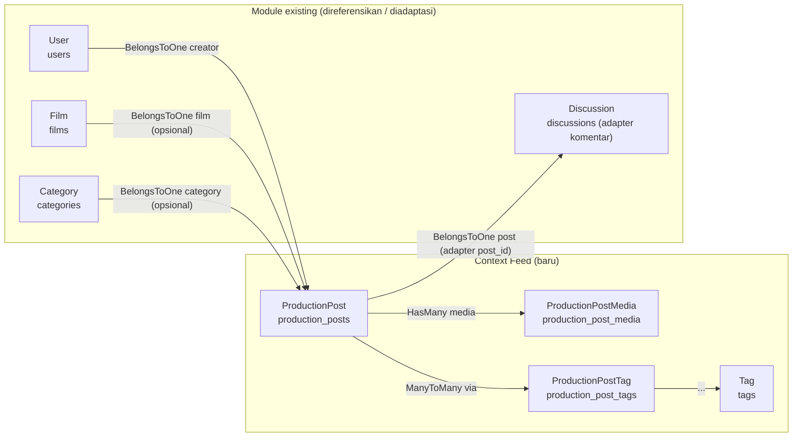

# 🧩 Objection Model — Production Feed

> Implementasi **Objection.js Model** untuk bounded context **Production Feed**, sesuai `docs/feed/DATABASE_PRODUCTION_FEED.md`.
>
> - **Hanya model** — tanpa business logic, route, atau controller (sesuai GLOBAL RULES).
> - Mengikuti style existing: `src/models/*.js`, extends `BaseModel`, `tableName`, `idColumn`, `jsonSchema`, `relationMappings`, modelClass string (di-resolve via `BaseModel.modelPaths`).
> - Relation mapping dibuat untuk **semua** tabel feed + referensi ke module existing (`User`, `Film`, `Category`).

---

## 1. File Model

| File | Tabel | PK | Relations |
|---|---|---|---|
| `src/models/ProductionPost.js` | `production_posts` | `post_id` | creator, film, category, media, tags |
| `src/models/ProductionPostMedia.js` | `production_post_media` | `media_id` | post |
| `src/models/Tag.js` | `tags` | `tag_id` | posts |
| `src/models/ProductionPostTag.js` | `production_post_tags` | `post_id` (PK komposit) | post, tag |
| `src/models/Discussion.js` (diadaptasi) | `discussions` | `diskusi_id` | user, film, **post** (adapter komentar) |

> Komentar Post **tidak punya model baru**: memakai `Discussion` existing. `Discussion.js` hanya ditambah kolom `post_id` (nullable) + relasi `post` (BelongsToOne → `production_posts`); `film_id` diberi nullable. Perilaku komentar film existing tidak berubah.
>
> `ProductionPostTag` memakai `idColumn = 'post_id'` (konvensi Objection mengharuskan satu kolom; junction tetap bisa dipakai melalui relation `through`, dan `$beforeInsert`/`$beforeUpdate` tetap bekerja via `BaseModel`). Timestamps tidak diisi karena tabel junction hanya berisi FK.

---

## 2. Relation Mapping

### Detail mapping per model

**`ProductionPost`** — relasi induk feed:

| Relation | Tipe | modelClass | join |
|---|---|---|---|
| `creator` | `BelongsToOneRelation` | `User` | `production_posts.user_id → users.id` |
| `film` | `BelongsToOneRelation` | `Film` | `production_posts.film_id → films.film_id` |
| `category` | `BelongsToOneRelation` | `Category` | `production_posts.category_id → categories.category_id` |
| `media` | `HasManyRelation` | `ProductionPostMedia` | `production_posts.post_id → production_post_media.post_id` |
| `tags` | `ManyToManyRelation` | `Tag` | via `production_post_tags` (`post_id → tag_id` → `tags.tag_id`) |

**`ProductionPostMedia`** — hanya relasi balik ke post (belongsTo).

**`Tag`** — `posts` (ManyToManyRelation → `ProductionPost`, via junction).

**`ProductionPostTag`** — `post` dan `tag` (keduanya BelongsToOne).

**`Discussion` (diadaptasi)** — menambah relasi `post` (BelongsToOne → `production_posts.post_id`); `user` & `film` relasi existing tetap. Komentar Post dibaca/ditulis lewat adapter (`productionFeed.commentAdapter.js`), bukan lewat relasi `ProductionPost.comments`.

---

## 3. jsonSchema (Validasi level model)

| Model | required | Kolom enum |
|---|---|---|
| `ProductionPost` | `user_id`, `judul`, `isi_konten` | `tipe` [`progress`,`behind_the_scenes`,`casting`,`announcement`,`wrap`]; `status` [`draft`,`published`,`archived`]; `visibility` [`public`,`private`] |
| `ProductionPostMedia` | `post_id`, `media_type`, `file_path` | `media_type` [`photo`,`video`,`pdf`] |
| `Tag` | `nama_tag`, `slug` | — |
| `ProductionPostTag` | `post_id`, `tag_id` | — |
| `Discussion` | `user_id`, `isi_pesan` (`post_id` & `film_id` nullable) | — |

Pola mengikuti `Film.jsonSchema` (kolom nullable: `{ type: ['integer', 'null'] }`, enum: `{ type: 'string', enum: [...] }`, boolean boleh `['boolean','integer']`).

---

## 4. Review

### 4.1 Kesesuaian style existing
- ✅ Header komentar `src/models/Nama.js` + deskripsi (pola semua model).
- ✅ `import { BaseModel } from './BaseModel.js';`, class `extends BaseModel`.
- ✅ Getter statis `tableName`, `idColumn`, `jsonSchema`, `relationMappings` (pola `CommunityDiscussion`, `Film`).
- ✅ `modelClass` berupa string → di-resolve lewat `BaseModel.modelPaths` (ESM), bukan import sirkular.
- ✅ Tidak menambahkan hook/utility baru; timestamp & modifier tetap dari `BaseModel`.

### 4.2 Reusability & low coupling
- ✅ Referensi ke `User`, `Film`, `Category` via relasi — **tanpa** memodifikasi model/module tersebut.
- ✅ Slug **tidak** diimplementasikan ulang di model; saat publish service akan memakai `Film.generateSlug(judul, id)` yang sudah ada (prinsip *jangan duplicate code*).
- ✅ Junction `ProductionPostTag` memungkinkan operasi M:N terpisah tanpa menyentuh `tags`/`production_posts` milik module lain.

### 4.3 Poin yang diperiksa (self-review)
- [x] Semua 4 tabel feed memiliki model (+ adaptasi `Discussion` untuk komentar).
- [x] Semua relasi sesuai ERD & FK migration (`users.id`, `films.film_id`, `categories.category_id`, FK feed internal).
- [x] `ManyToManyRelation` menggunakan `through` yang mencocokkan struktur `production_post_tags` (`post_id`, `tag_id`).
- [x] `jsonSchema` sesuai kolom migration (nullable & enum benar).
- [x] Model **tidak** memuat business logic (tidak ada method CRUD/logika filter/notifikasi).
- [x] Syntax & loading tervalidasi: `node --check` + import runtime → semua model load, relasi `creator, film, category, media, tags` & `post` di `Discussion` ter-resolve.

### 4.4 Perubahan lintas module (alasan)
- **`src/models/index.js` ditambahkan 4 export baru** — wajib agar Objection dapat me-resolve `modelClass` string dan service/controller feed (di tahap berikutnya) dapat mengimpor model. Hanya penambahan baris, tidak mengubah export existing.
- **`src/models/Discussion.js` diubah minimal** (keputusan adapter komentar): `jsonSchema` `film_id` → nullable + tambah `post_id` nullable (required hanya `user_id`, `isi_pesan`); tambah relasi `post` (BelongsToOne → `production_posts`). Tidak ada perubahan pada relasi `user`/`film` atau behavior komentar film.

---

## 5. Testing Checklist

- [ ] `node --check` semua model baru (✔ sudah OK di verifikasi).
- [ ] Import runtime `models/index.js` → 4 model baru ter-export tanpa error (✔ sudah OK).
- [ ] Verifikasi relasi memakai query aktual setelah `npm run migrate` (butuh DB):
  - [ ] `ProductionPost.query().withGraphFetched('creator')` → data user penulis.
  - [ ] `withGraphFetched('film')` → film (atau `null` bila `film_id` kosong).
  - [ ] `withGraphFetched('category')` → kategori (atau `null`).
  - [ ] `withGraphFetched('media')` → daftar media terurut `sort_order`.
  - [ ] `withGraphFetched('tags')` → daftar tag via junction.
  - [ ] `Discussion.query().withGraphFetched('post')` → post (adapter; komentar film `post_id=NULL` → `null`).
- [ ] Insert post via `ProductionPost.query().insert(...)` → `created_at`/`updated_at` terisi otomatis (BaseModel).
- [ ] Insert media/tag → `jsonSchema` required & enum ter-enforce (tipe `media_type` invalid ditolak).
- [ ] Insert `discussions` dengan `post_id` maupun `film_id` → keduanya diterima (nullable); komentar film existing tetap valid.
- [ ] Soft delete: kolom `deleted_at` di-set manual tanpa menghapus baris (logika filter = tanggung jawab service berikutnya, bukan model).

---

## 6. Checklist Self-Review

- [x] Hanya model — tanpa business logic, route, controller.
- [x] Relation mapping lengkap untuk semua tabel feed + referensi module existing.
- [x] Style existing diikuti (BaseModel, getter statis, modelClass string, jsonSchema).
- [x] Reusability (Film.generateSlug, User/Film/Category tanpa modifikasi).
- [x] Sesuai `docs/feed/DATABASE_PRODUCTION_FEED.md` & migration.
- [x] Syntax & resolusi relasi tervalidasi.
